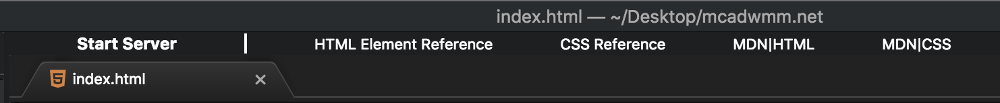

# p5js-toolbar
p5js-toolbar adds helpful tools and a built in express server for web development to [atom.io](http://atom.io)!

### GUI
web-toolbar features a button to run/stop a localhost server and quick links to common resources.

### Keyboard Shortcuts
Task              | Command
------------------|----------------------
Open the toolbar: | Control + Option + w
Run Server:       | Control + Option + r
Stop Server:      | Control + Option + s

### Command Palette & Packages Menu
web-toolbar supports atom's built in command palette accessibale via `Command + Shift + p`.